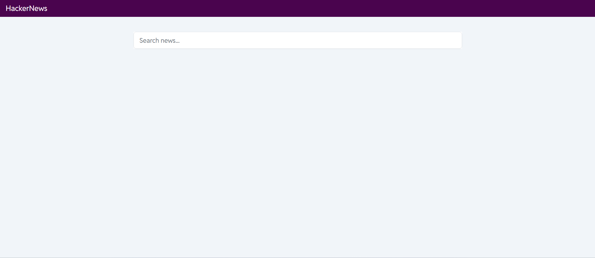
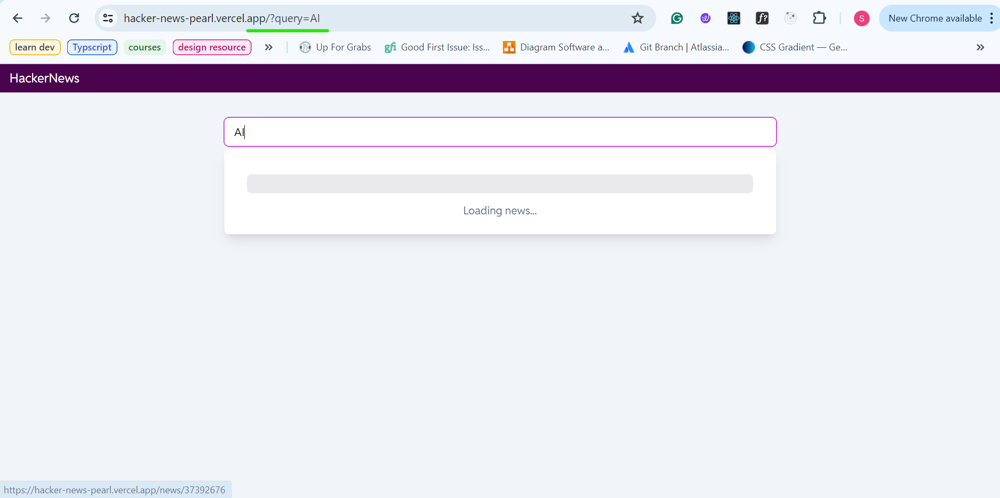
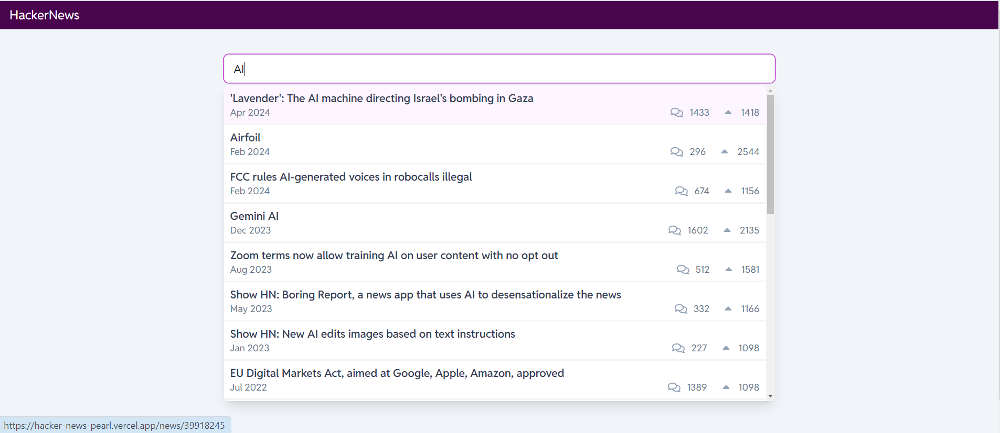
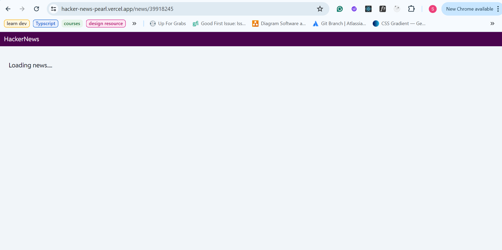
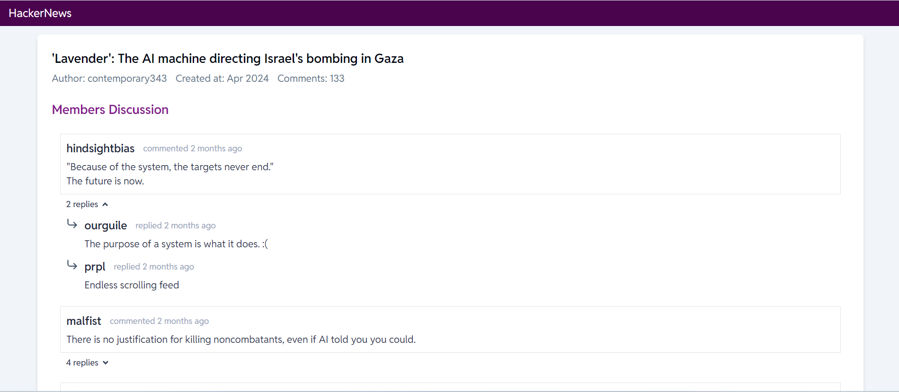

# HackerNews

### How to run this project:

1. Clone the repo:

```
git clone https://github.com/Shwetzksk/hacker-news.git
```

2. Install dependencies

```
pnpm i
```

3. Start project at localhost

```
pnpm run dev
```

### Built On:

- React Query
- Vitest
- Typescript
- DateFns
- Shadcn
- Tailwind
- React Icons

### Screenshots:






